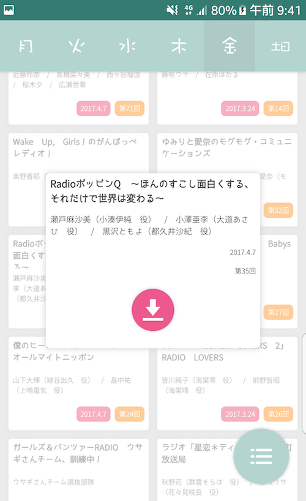
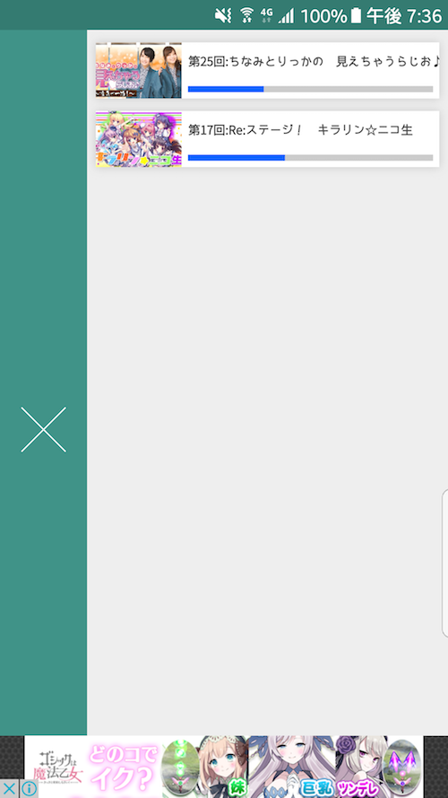

# 音卵
音卵は、声優ラジオサイト音泉をダウンロードするAndroidアプリです。

- 音卵についての紹介ページ
  - [Qiita - Cordovaで声優ラジオ音泉をダウンロードするAndroidアプリを作ってみた](http://qiita.com/yuki540/items/45d2bc788fffb7e62e0a)
- 音卵のダウンロード
  - [Google Play - 音卵](https://play.google.com/store/apps/details?id=com.yuki540.ontama)
- 開発者
  - yuki540
  - [Twitter - @eriri_jp](https://twitter.com/eriri_jp)
  - [HP - yuki540.com](http://yuki540.com)
  
# なんでその名前？
開発当初、温泉卵が食べたかったので、「音泉」と「温泉卵」を掛けて「音卵」というアプリ名にしました。

「音卵」は、曜日ごとの番組を表示し、誰でも簡単にダウンロードすることができます。
また、可愛くてフラットなデザインなUIに仕上げました。

### 番組一覧画面

### 番組選択画面

### ダウンロード状況画面

## Lisence

このソフトウェアは、MIT Lisenceのもとで公開されています。
